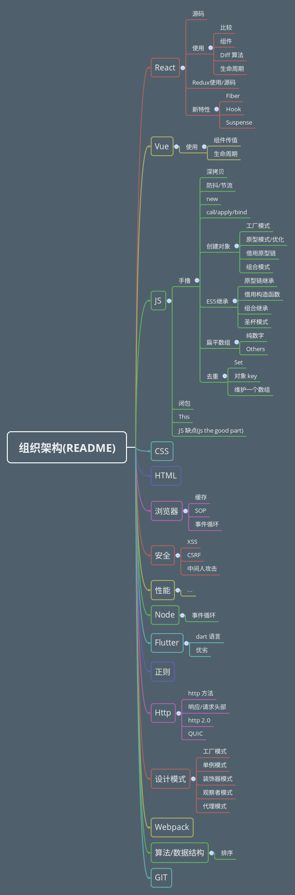

## 前端知识架构

文件在 MD 文件夹

index为基本使用或目录, 其他则为深入理解

src文件夹 是 React 项目

Vue文件夹 是 Vue 项目

包含 Node 在 server 文件夹

参考: 

[伢羽大大的JS深入](https://github.com/mqyqingfeng/Blog)

...

## React

[基本使用](./MD/React/index.md)

## Vue

[基本使用](./MD/Vue/index.md)

## Webpack

[基本使用](./MD/Webpack/index.md)

## HTTP

[基本](./MD/HTTP/index.md)

## NET(计网)

[基本](./MD/NET/index.md)

## JS

[目录(多个系列)](./MD/JS/index.md)

## 正则表达式

[正则](./MD/RegExp/index.md)

## HTML

[目录(多个系列)](./MD/HTML/index.md)

## CSS

[目录(多个系列)](./MD/CSS/index.md)

## Security(安全)

[基本](./MD/Security/index.md)

## 浏览器

[目录(多个系列)](./MD/Broswer/index.md)

## 算法

[目录(多个系列)](./MD/Algorithm/index.md)

# 图片组织架构(updating)

一星机构:13276567890/qwe12345 机构Id:1294956 code:1294956 齐测产品灵活售卖8
二星机构-标准学习包：13267890987 机构id：1294952 code：1294952 齐测产品灵活售卖4
二星机构-3阶课：13192361131 机构id：1294988 code:1294988  齐测灵活售卖122101
三星机构：19000000000 机构id：4155 code：glyjg67,管理员机构67  测试机构  
机构密码都是qwe12345